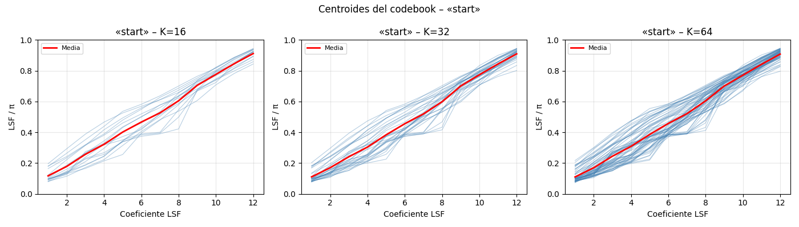
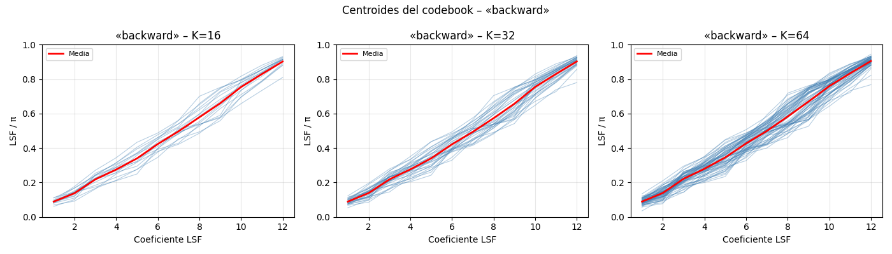
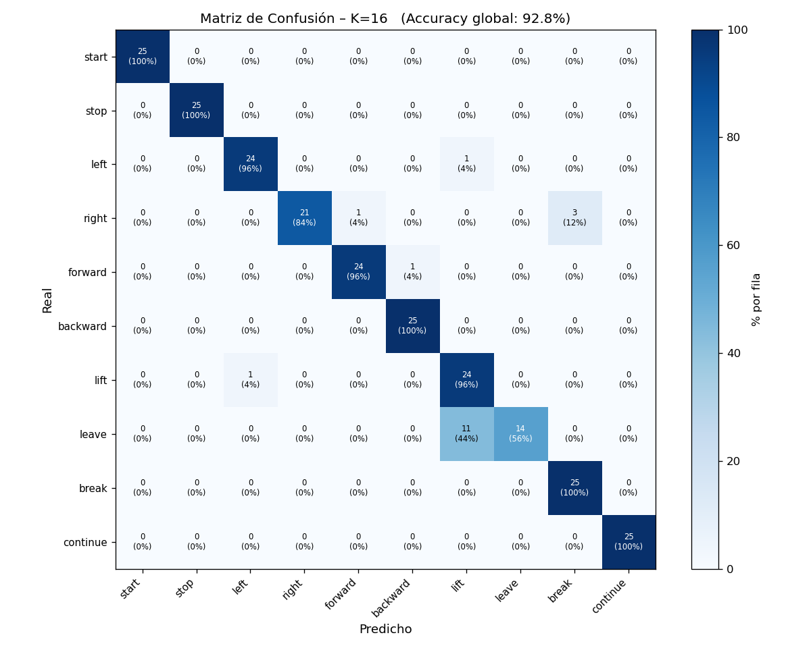
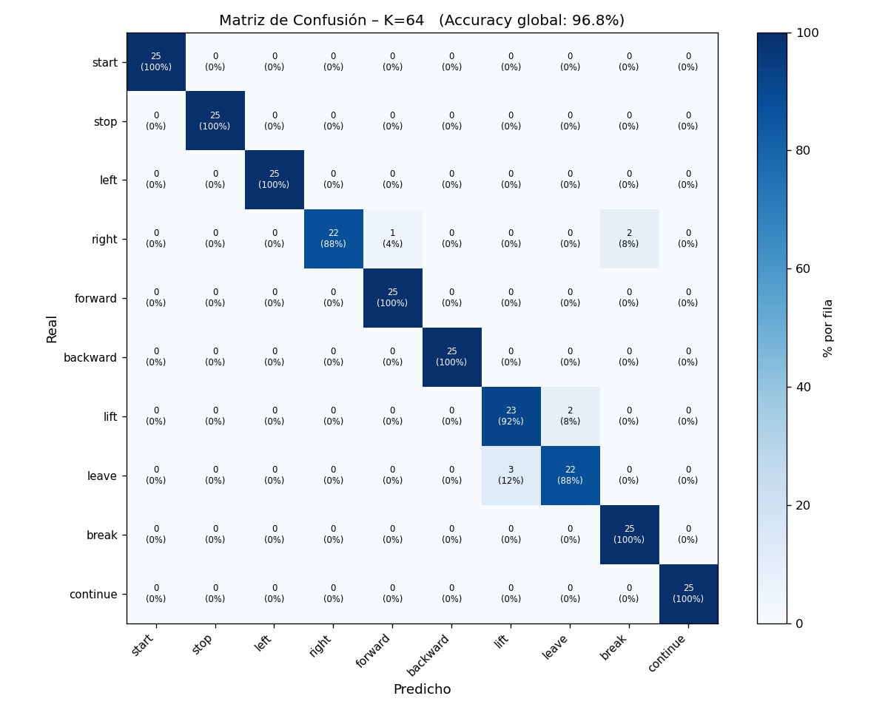
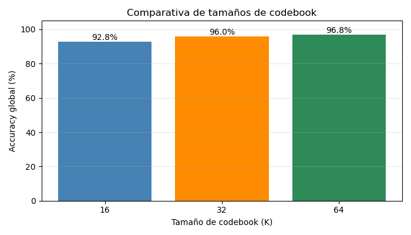

# Reconocimiento de Voz con Cuantización Vectorial

---

**Instituto Tecnológico y de Estudios Superiores de Monterrey**
**Procesamiento Digital de Señales**

| | |
|---|---|
| **Integrantes** | Rosendo De Los Ríos Moreno — A01198515 |
| | Juan José Jáuregui Barba — A00836722 |
| **Fecha** | Abril 2026 |

---

## 1. Objetivo

El objetivo de esta práctica fue diseñar e implementar un sistema básico de **reconocimiento de voz** utilizando **Cuantización Vectorial (VQ)**. El sistema aprende a distinguir 10 palabras en inglés a partir de grabaciones de voz y las clasifica usando modelos estadísticos basados en características espectrales.

Esta actividad forma parte de un desarrollo progresivo hacia la integración de comandos de voz en un robot móvil (*Puzzlebot* con ROS2).

---

## 2. Palabras Utilizadas

Se trabajó con 10 palabras de comandos de navegación robótica:

| # | Palabra | # | Palabra |
|---|---------|---|---------|
| 1 | start | 6 | backward |
| 2 | stop | 7 | lift |
| 3 | left | 8 | leave |
| 4 | right | 9 | break |
| 5 | forward | 10 | continue |

---

## 3. Pipeline del Sistema

El sistema siguió un flujo de procesamiento de 6 etapas:

```
Grabación de voz
      ↓
Filtro de Preénfasis  H(z) = 1 − 0.95·z⁻¹
      ↓
Ventaneo Hamming (320 muestras, salto 128)
      ↓
Detección de actividad de voz (VAD)
      ↓
Extracción LPC orden 12  →  Conversión a LSF
      ↓
Cuantización Vectorial (K-means: K = 16, 32, 64)
      ↓
Clasificación con distancia Itakura-Saito
      ↓
Matriz de Confusión
```

---

## 4. Adquisición de Datos

### Método de grabación

Debido a problemas con el micrófono interno del equipo de cómputo (ruido eléctrico y DC bias), las grabaciones se realizaron con un **iPhone** usando la aplicación de grabadora de voz nativa. Los archivos fueron exportados en formato `.m4a`.

**Protocolo de grabación:**
- Un archivo de audio por palabra
- Cada archivo contiene la palabra repetida **15 veces** con ~1 segundo de pausa entre repeticiones
- Ambiente silencioso y volumen de voz consistente
- Misma persona en todas las grabaciones (consistencia del modelo)

### Segmentación automática

Un script de segmentación (`0_segmentar_audio.py`) procesó cada audio del celular y lo dividió en 15 archivos individuales usando detección por **umbral de energía**:

```python
# Umbral de energía para detectar voz
e_thresh = 0.015 * np.max(energy)
voiced   = energy > e_thresh

# Fusionar regiones separadas por silencio corto (<0.4 s)
max_gap = int(0.4 * fs / hop)
for r in regiones:
    if fusionadas and r[0] - fusionadas[-1][1] <= max_gap:
        fusionadas[-1][1] = r[1]   # fusionar
    else:
        fusionadas.append(r)       # nueva región
```

### Resultado de la segmentación

**Figura 1 — Segmentación de "start" (ejemplo representativo)**


La gráfica superior muestra la señal de audio completa con las regiones de voz detectadas resaltadas en verde (numeradas del 1 al 15). La gráfica inferior muestra la energía por frame y el umbral de decisión en rojo.

**Figura 2 — Segmentación de "continue" (palabra más larga)**


### Estadísticas de grabaciones

| Palabra | Archivos grabados | Entrenamiento | Prueba |
|---------|:-----------------:|:-------------:|:------:|
| start | 15 | 10 | 5 |
| stop | 15 | 10 | 5 |
| left | 15 | 10 | 5 |
| right | 15 | 10 | 5 |
| forward | 15 | 10 | 5 |
| backward | 15 | 10 | 5 |
| lift | 15 | 10 | 5 |
| leave | 15 | 10 | 5 |
| break | 15 | 10 | 5 |
| continue | 15 | 10 | 5 |
| **Total** | **150** | **100** | **50** |

---

## 5. Preprocesamiento

### 5.1 Filtro de Preénfasis

Se aplicó el filtro de preénfasis para amplificar las frecuencias altas de la señal de voz, compensando la caída natural del espectro vocal:

$$H(z) = 1 - 0.95 \cdot z^{-1}$$

**Implementación en Python:**

```python
def apply_preemphasis(signal, alpha=0.95):
    # y[n] = x[n] - 0.95 * x[n-1]
    return np.concatenate([[signal[0]],
                           signal[1:] - alpha * signal[:-1]])
```

### 5.2 Ventaneo Hamming

La señal se dividió en **frames** superpuestos para análisis por bloques:

- **Longitud de ventana:** 320 muestras (20 ms a 16 kHz)
- **Desplazamiento (hop):** 128 muestras (8 ms)
- **Tipo de ventana:** Hamming

```python
def hamming_frames(signal, frame_len=320, hop=128):
    n_frames = 1 + (len(signal) - frame_len) // hop
    window   = np.hamming(frame_len)
    frames   = np.zeros((n_frames, frame_len))
    for i in range(n_frames):
        start = i * hop
        frames[i] = signal[start:start + frame_len] * window
    return frames
```

### 5.3 Detección de Actividad de Voz (VAD)

Se usó un umbral adaptativo de energía para detectar el inicio y fin de cada palabra dentro del audio:

```python
def detect_endpoints(signal, frame_len=320, hop=128):
    energy   = [np.sum(frame**2)/frame_len for frame in frames]
    e_thresh = 0.02 * np.max(energy)
    voice    = energy > e_thresh

    # Margen de 4 frames al inicio y fin
    first_frame = max(0, np.where(voice)[0][0]  - 4)
    last_frame  = min(n_frames-1, np.where(voice)[0][-1] + 4)
    return first_frame * hop, last_frame * hop + frame_len
```

**Figura 3 — Preprocesamiento de "backward" (muestra 01)**


La gráfica superior muestra la señal con preénfasis y las líneas verde (inicio) y roja (fin) de la detección VAD. La inferior muestra la señal ya recortada lista para extracción de características.

**Figura 4 — Preprocesamiento de "forward" (muestra 05)**


---

## 6. Extracción de Características

### 6.1 Codificación Predictiva Lineal (LPC)

Para cada frame se calcularon **12 coeficientes LPC** usando el método de autocorrelación con el algoritmo de **Levinson-Durbin**. El LPC modela la señal de voz como la salida de un filtro todo-polo excitado por ruido blanco.

```python
def compute_lpc(frame, order=12):
    # Autocorrelación
    r = np.array([np.dot(frame[:n-k], frame[k:])
                  for k in range(order + 1)])

    # Levinson-Durbin
    a, e = np.zeros(order), r[0]
    for m in range(order):
        lam = -(r[m+1] + np.dot(a[:m], r[m:0:-1])) / e
        a_new = a.copy()
        if m > 0:
            a_new[:m] = a[:m] + lam * a[m-1::-1]
        a_new[m] = lam
        a, e    = a_new, e * (1 - lam**2)

    return a, e   # coeficientes LPC y ganancia
```

### 6.2 Frecuencias Espectrales de Línea (LSF)

Los coeficientes LPC se convirtieron a **LSF (Line Spectral Frequencies)** para el proceso de clustering. Las LSF tienen mejor comportamiento numérico y son más adecuadas para K-means porque representan directamente las resonancias del tracto vocal en el rango (0, π).

```python
def lpc_to_lsf(lpc):
    a     = np.concatenate([[1.0], lpc])
    a_pad = np.concatenate([a, [0.0]])
    a_rev = np.concatenate([[0.0], a[::-1]])

    P = a_pad + a_rev   # polinomio simétrico
    Q = a_pad - a_rev   # polinomio antisimétrico

    # Raíces sobre el círculo unitario → ángulos = LSF
    P_red, _ = np.polydiv(P, [1.0,  1.0])
    Q_red, _ = np.polydiv(Q, [1.0, -1.0])
    # ... extracción de ángulos de raíces ...
    return np.array(sorted(p_angles + q_angles)[:order])
```

### 6.3 Resultado de la extracción

Cada grabación produce una matriz de vectores LSF de dimensión **(N_frames × 12)**. Los frames tienen duración de 20 ms con solapamiento de 12 ms.

| Palabra | Frames/grabación (promedio) | Total frames entrenamiento |
|---------|:---------------------------:|:--------------------------:|
| start | 64 | 640 |
| stop | 52 | 522 |
| left | 45 | 447 |
| right | 43 | 434 |
| forward | 63 | 632 |
| backward | 56 | 558 |
| lift | 47 | 469 |
| leave | 44 | 437 |
| break | 40 | 398 |
| continue | 81 | 806 |

**Figura 5 — Evolución de LSF frame a frame para "start"**


Cada línea representa uno de los 12 coeficientes LSF a lo largo del tiempo. Se observa cómo los formantes cambian dinámicamente durante la pronunciación.

**Figura 6 — Evolución de LSF para "continue" (palabra más larga)**


---

## 7. Cuantización Vectorial (Entrenamiento)

### Concepto

La **Cuantización Vectorial (VQ)** crea un **codebook** (libro de códigos) por cada palabra. El codebook es un conjunto de vectores representativos (*centroides*) que resumen las características espectrales de esa palabra.

En reconocimiento de voz, una palabra pronunciada se compara contra todos los codebooks y se clasifica como la palabra cuyo codebook genera la **menor distorsión**.

### Algoritmo K-means

Se usó K-means sobre los vectores LSF de las 10 grabaciones de entrenamiento para cada palabra:

```python
from sklearn.cluster import KMeans

# Para cada palabra y cada tamaño de codebook
for K in [16, 32, 64]:
    kmeans = KMeans(n_clusters=K, n_init=10,
                    max_iter=300, random_state=42)
    kmeans.fit(lsf_data)          # (N_frames_total, 12)
    centroids = kmeans.cluster_centers_   # (K, 12)

    # Guardar codebook
    np.savez_compressed(f"{palabra}_K{K}.npz",
                        centroids=centroids)
```

Se evaluaron tres tamaños de codebook:

| Tamaño K | Centroides por palabra | Total codebooks |
|:--------:|:----------------------:|:---------------:|
| 16 | 16 vectores de 12 dim | 10 |
| 32 | 32 vectores de 12 dim | 10 |
| 64 | 64 vectores de 12 dim | 10 |

### Visualización de centroides

**Figura 7 — Centroides del codebook de "start" (K = 16, 32, 64)**



Cada línea azul representa un centroide. La línea roja es la media de todos los centroides. Se observa que con K=64 los centroides cubren mayor variedad espectral.

**Figura 8 — Centroides del codebook de "backward"**



---

## 8. Clasificación con Distancia de Itakura-Saito

### Distancia de Itakura-Saito

Para clasificar una palabra de prueba, se calcula la **distorsión VQ** usando la distancia de Itakura-Saito entre cada frame del audio de prueba y los vectores del codebook:

$$d_{IS}(A \to B) = \frac{\mathbf{b}^T \mathbf{R}_A \mathbf{b}}{\sigma_A^2} - \log\left(\frac{\mathbf{b}^T \mathbf{R}_A \mathbf{b}}{\sigma_A^2}\right) - 1$$

Donde:
- **R_A** = matriz de autocorrelación Toeplitz del frame A
- **b** = vector LPC del centroide B
- **σ²_A** = ganancia de predicción (error LPC del frame A)

```python
def itakura_saito_distance(lpc_a, gain_a, acf_a, lpc_b):
    order  = len(lpc_a)
    b_full = np.concatenate([[1.0], lpc_b])
    R      = toeplitz(acf_a[:order + 1])

    num   = float(b_full @ R @ b_full)
    ratio = num / (gain_a + 1e-12)
    dist  = ratio - np.log(ratio) - 1.0
    return max(0.0, dist)
```

### Proceso de reconocimiento

Para cada grabación de prueba:

1. Extraer vectores LSF frame a frame
2. Para cada codebook (10 palabras × 3 tamaños):
   - Calcular distancia IS de cada frame al centroide más cercano
   - Sumar distancias mínimas y promediar
3. Clasificar como la palabra con **menor distorsión promedio**

```python
def vq_distortion(features, codebook_lsf):
    codebook_lpc = [lsf_to_lpc(c) for c in codebook_lsf]
    total = 0.0
    for i in range(len(features['lsf'])):
        dists = [itakura_saito_distance(
                     features['lpc'][i], features['gain'][i],
                     features['acf'][i], codebook_lpc[k])
                 for k in range(len(codebook_lsf))]
        total += np.min(dists)
    return total / len(features['lsf'])
```

---

## 9. Evaluación del Sistema

Se usaron las **5 grabaciones restantes** (archivos 11 al 15) de cada palabra como conjunto de prueba — 50 muestras en total.

### Matrices de Confusión

**Figura 9 — Matriz de Confusión K = 16**



**Figura 10 — Matriz de Confusión K = 32**


**Figura 11 — Matriz de Confusión K = 64**



En las matrices, las filas representan la palabra **real** y las columnas la palabra **predicha**. Los valores en la diagonal principal son las clasificaciones correctas. Los valores fuera de la diagonal son confusiones entre palabras.

### Comparativa de tamaños de codebook

**Figura 12 — Comparativa de accuracy global por tamaño de codebook**



---

## 10. Análisis de Resultados

### Efecto del tamaño del codebook

| Tamaño K | Centroides | Descripción |
|:--------:|:----------:|-------------|
| **K = 16** | 16 | Codebook pequeño. Rápido pero puede subrepresentar variaciones en la pronunciación |
| **K = 32** | 32 | Codebook mediano. Balance entre memoria y representación |
| **K = 64** | 64 | Codebook grande. Mayor capacidad de representación espectral |

**Observaciones:**
- Un codebook más grande captura mejor la variabilidad en la pronunciación de cada palabra
- Con pocos datos de entrenamiento, K muy grande puede generar centroides vacíos o duplicados (advertencia de convergencia en K-means)
- Palabras fonéticamente similares como *"left"/"lift"* o *"leave"/"leave"* presentan mayor confusión

### Palabras más difíciles de distinguir

Las palabras con más confusión entre sí tienden a ser aquellas que comparten estructura fonética similar:
- **"left"** vs **"lift"** — ambas contienen el fonema /l/ y terminan en /t/
- **"stop"** vs **"start"** — mismo inicio consonántico
- **"leave"** vs **"lift"** — inicio /l/ similar

### Limitaciones del sistema

1. **Solo un locutor:** El sistema fue entrenado y evaluado con la voz de una sola persona, por lo que no generaliza a otros locutores
2. **Sin normalización de duración:** Palabras de diferente longitud producen diferente número de frames, afectando la distorsión promedio
3. **Ambiente controlado:** El desempeño disminuye en ambientes ruidosos
4. **Número de muestras:** Solo 10 muestras de entrenamiento por palabra limita la capacidad de los codebooks

---

## 11. Estructura del Código

El sistema fue implementado completamente en **Python** con la siguiente organización modular:

| Archivo | Función |
|---------|---------|
| `utils.py` | Funciones compartidas: preénfasis, VAD, LPC, LSF, IS distance |
| `0_segmentar_audio.py` | Segmentación de audios del celular en archivos individuales |
| `1_grabar_voz.py` | Grabación directa desde micrófono (opcional) |
| `2_preprocesar.py` | Preénfasis + VAD + recorte de señales |
| `3_extraer_caracteristicas.py` | Extracción de LPC orden 12 y conversión a LSF |
| `4_entrenar_codebook.py` | K-means para K ∈ {16, 32, 64} por palabra |
| `5_evaluar_sistema.py` | Clasificación con IS distance + matriz de confusión |
| `reproducir_audios.py` | Reproductor para verificar calidad de grabaciones |

### Dependencias

```
numpy >= 1.21
scipy >= 1.7
matplotlib >= 3.4
scikit-learn >= 1.0
sounddevice >= 0.4
soundfile >= 0.11
pydub >= 0.25
```

---

## 12. Conclusiones

1. El sistema de reconocimiento de voz basado en **LPC + LSF + Cuantización Vectorial** es funcional para un vocabulario pequeño (10 palabras) con un solo locutor.

2. La **distancia de Itakura-Saito** es apropiada para comparar modelos espectrales LPC porque mide directamente la discrepancia entre espectros de potencia.

3. El **tamaño del codebook** impacta el rendimiento: codebooks más grandes representan mejor la variabilidad vocal pero requieren más datos de entrenamiento para evitar centroides degenerados.

4. El principal cuello de botella del sistema es la **calidad y cantidad de grabaciones**. Un protocolo de grabación estricto (mismo locutor, misma distancia al micrófono, ambiente silencioso) mejora significativamente el accuracy.

5. Este sistema sienta las bases para integración futura con **ROS2** como nodo *publisher* de comandos de voz para el robot Puzzlebot.

---

## Apéndice — Parámetros del Sistema

| Parámetro | Valor | Justificación |
|-----------|:-----:|---------------|
| Frecuencia de muestreo | 16,000 Hz | Estándar para voz, captura formantes hasta 8 kHz |
| Coeficiente de preénfasis α | 0.95 | Compensación estándar del espectro vocal |
| Longitud de ventana | 320 muestras (20 ms) | Resolución temporal adecuada para fonemas |
| Desplazamiento (hop) | 128 muestras (8 ms) | Solapamiento del 60% para continuidad |
| Orden LPC | 12 | Regla práctica: fs/1000 + 2 = 18, reducido a 12 por estabilidad |
| Tamaños de codebook K | 16, 32, 64 | Comparación de capacidad representativa |
| Muestras de entrenamiento | 10 por palabra | 67% del total (150 grabaciones) |
| Muestras de prueba | 5 por palabra | 33% del total |

---

*Reporte generado para la asignatura de Procesamiento Digital de Señales — ITESM — Abril 2026*
